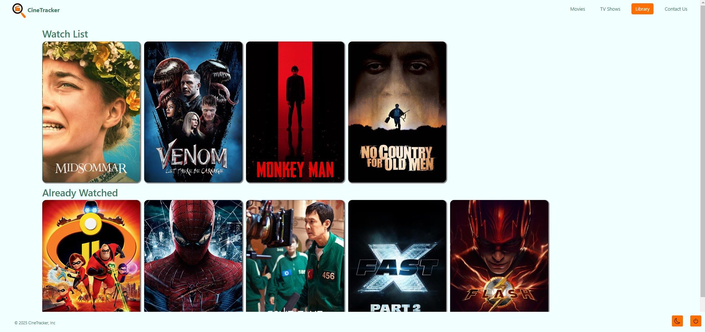
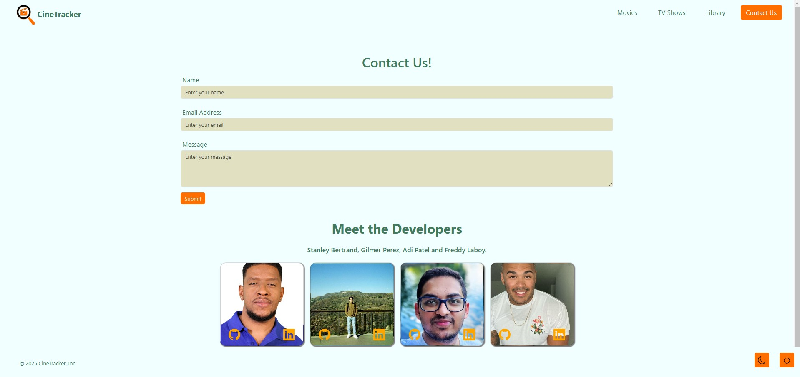

# CineTracker

## Project Overview

CineTracker is a full-stack web application designed for movie and TV show enthusiasts who want to keep track of what they’ve watched and what they plan to watch. The platform allows users to search for movies and TV shows using the OMDb API, add titles to their personal library, and categorize them based on viewing status.

The goal of CineTracker is to provide an interactive and user-friendly experience for managing entertainment choices while implementing authentication to ensure personalized libraries for each user. Built using the PERN stack (PostgreSQL, Express, React, Node.js), the application features a robust back-end with secure authentication using JWT, a dynamic front-end with React, and a Sequelize ORM database integration for persistent storage.

## Table of Contents

- [Usage](#usage)
- [Mock Up](#mock-up)
- [Instructions](#instructions)
- [Key Features](#key-features)
- [Technology Stack](#technology-stack)
- [Additional Resources](#additional-resources)

## Usage

To start the application, run the following commands:

1. Install dependencies:
```bash
npm install
```

2. Set up environment variables in a `.env` file

3. Run the application:
```bash
npm run start:dev
```

## Mock-Up

The following animation shows the web application's appearance and functionality:






## Instructions

1. Clone the repository:
```bash
git clone git@github.com:gilmerperez/cinetracker.git
```

2. navigate to the project directory:
```bash
cd cinetracker
```

3. Install dependencies: 
```bash
npm install
```

4. Set up a PostgreSQL database and configure the .env file.

5. Run the application:
```bash
npm run start:dev
```

## Key Features

* **Responsive Design:** Works on desktop and mobile devices.
* **Dynamic UI:** React-based front-end with an intuitive design.
* **Personal Library:** Users can add and categorize Movies and TV Shows.
* **Search Functionality:** Fetch Movies and TV Shows from the TMDb API.
* **User Authentication:** Secure login and signup using JWT authentication.
* **Theme Customization:** Users can switch between different theme colors.
* **Persistent Storage:** PostgreSQL database with Sequelize ORM integration.

## Technology Stack

This project relies on the following tools and technologies:
* **Back-end:** Node.js, Express.js
* **Database:** PostgreSQL, Sequelize ORM
* **Front-end:** React, TypeScript, CSS, Bootstrap
* **Hosting & Deployment:** Render Deployment
* **Authentication:** JSON Web Tokens, bcrypt for password hashing
* **API Integration:** TMDb & OMDb API for Movie and TV Show data

## Additional Resources

Google Cloud Services: [Google Cloud](https://cloud.google.com/)

TMDb API Documentation: [TMDb API](https://developer.themoviedb.org/reference/intro/getting-started)
